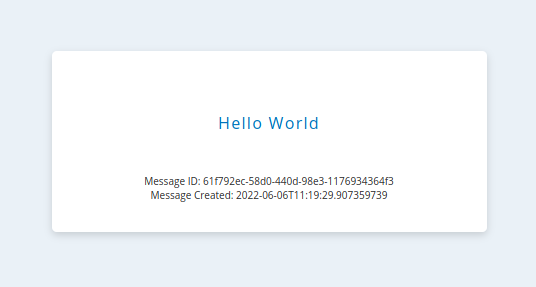
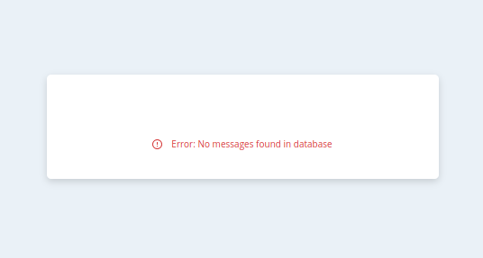

# GCP Hello World Demo Application

This is a Java application built on the Spring framework, used to demonstrate an "infrastructure-as-code" deployment
to Google Cloud Platform.

The application connects to a Google Cloud Spanner instance to retrieve the latest message in a database,
and displays the message on a web page. API endpoints to list messages and set new messages are also available.

Spring Boot application properties are retrieved from  

A live deployment of the application requires you to have a Google Cloud Platform account with billing enabled.
However, the application can be run in a "local" mode, where the application will connect to a Google Cloud
Spanner emulator and no Google Cloud Platform credentials need to be configured.

The application is intended to be deployed using the Terraform configuration [here](FIXME).

# Requirements

- Java 17 (JRE)

# Local Deployment

Get the code:

```shell
git clone https://github.com/zsrv/gcp-hello-world.git
cd gcp-hello-world
```

## Google Cloud Spanner Emulator

The steps listed here will run the emulator on your local machine using the gcloud CLI.
Other ways to run the emulator are described in
the [Cloud Spanner documentation](https://cloud.google.com/spanner/docs/emulator).

This quick start guide requires the gcloud CLI to be installed. If the gcloud CLI is
not installed, see the documentation above for details.

Start the emulator:

```shell
gcloud emulators spanner start
```

In a separate terminal, create a separate gcloud configuration for this application's local deployment:

```shell
gcloud config configurations create gcp-hello-world-emulator
gcloud config set auth/disable_credentials true
gcloud config set project gcp-hello-world-local
gcloud config set api_endpoint_overrides/spanner http://localhost:9020/
```

Create a Spanner instance, a database on the instance, and the required table on the database:

```shell
gcloud spanner instances create gcp-hello-world --config=emulator-config \
  --nodes=1 --description="Local Instance" \
  --configuration=gcp-hello-world-emulator
gcloud spanner databases create main --instance=gcp-hello-world \
  --configuration=gcp-hello-world-emulator
gcloud spanner databases ddl update main --instance=gcp-hello-world --ddl="$(<schema.ddl)" \
  --configuration=gcp-hello-world-emulator
```

The Spanner emulator is now ready to be used by the application.

## Application

The [Maven Wrapper](https://maven.apache.org/wrapper/) is included in the project as a convenient way to use
Maven without having to first install it.

Build the application, specifying the local profile (used when the tests are run).
The Cloud Spanner emulator must be running during the package phase since a connection to Cloud Spanner will
be attempted during the test phase. Alternatively, the tests can be skipped.

```shell
./mvnw clean package -Dspring.cloud.bootstrap.name=bootstrap-local

# Alternatively, skip the tests so packaging doesn't fail if the Cloud Spanner emulator is not running 
./mvnw clean package -DskipTests
```

Run the application, making sure to adjust the name of the jar if the version number has changed.
The application will listen on localhost:8080 by default:

```shell
java -jar target/gcp-hello-world-0.0.1-SNAPSHOT.jar --spring.cloud.bootstrap.name="bootstrap-local"
```

# Usage

The application will listen on [http://localhost:8080](http://localhost:8080) by default,
when running in local mode.

The main web page will display the most recent message in the database, along with
the message ID and the time the message was added to the database. If there are no messages,
or an error occurred, an error page will display instead.

Messages can be added to the database using the [API endpoints](#api-endpoints).

## API Endpoints

### GET /api/v1/messages

Returns all messages in the database.

```shell
curl -w '\n' -i -X GET http://localhost:8080/api/v1/messages
```

#### Examples

One message exists:

```text
$ curl -w '\n' -i -X GET http://localhost:8080/api/v1/messages
HTTP/1.1 200 
Content-Type: application/json
Transfer-Encoding: chunked
Date: Mon, 06 Jun 2022 11:12:14 GMT

[{"messageId":"365995c7-c327-4fcb-af07-30bd542e9b5c","message":"Hello World","creationTimestamp":"2022-06-06T11:05:59.491305932"}]
```

More than one message exists:

```text
$ curl -w '\n' -i -X GET http://localhost:8080/api/v1/messages
HTTP/1.1 200 
Content-Type: application/json
Transfer-Encoding: chunked
Date: Mon, 06 Jun 2022 11:17:03 GMT

[{"messageId":"365995c7-c327-4fcb-af07-30bd542e9b5c","message":"Hello World","creationTimestamp":"2022-06-06T11:05:59.491305932"},{"messageId":"5913dbf2-dc1f-4cf8-858c-7bba324dfece","message":"Hello World Two","creationTimestamp":"2022-06-06T11:16:55.470348823"}]
```

No messages exist:

```text
$ curl -w '\n' -i -X GET http://localhost:8080/api/v1/messages
HTTP/1.1 200 
Content-Type: application/json
Transfer-Encoding: chunked
Date: Mon, 06 Jun 2022 11:04:30 GMT

[]
```

### GET /api/v1/messages/{messageId}

Returns the message with the given id.

```shell
curl -w '\n' -i -X GET http://localhost:8080/api/v1/messages/c51c38f0-9e5c-404f-abce-edd18280dbe5
```

#### Examples

Message with given id exists:

```text
$ curl -w '\n' -i -X GET http://localhost:8080/api/v1/messages/365995c7-c327-4fcb-af07-30bd542e9b5c
HTTP/1.1 200 
Content-Type: application/json
Transfer-Encoding: chunked
Date: Mon, 06 Jun 2022 11:09:36 GMT

{"messageId":"365995c7-c327-4fcb-af07-30bd542e9b5c","message":"Hello World","creationTimestamp":"2022-06-06T11:05:59.491305932"}
```

Message with given id does not exist:

```text
$ curl -w '\n' -i -X GET http://localhost:8080/api/v1/messages/c51c38f0-9e5c-404f-abce-edd18280dbe5
HTTP/1.1 404 
Content-Type: application/json
Transfer-Encoding: chunked
Date: Mon, 06 Jun 2022 11:06:46 GMT

{"timestamp":"2022-06-06T11:06:46.242+00:00","status":404,"error":"Not Found","path":"/api/v1/messages/c51c38f0-9e5c-404f-abce-edd18280dbe5"}
```

### GET /api/v1/messages/latest

Returns the message most recently added to the database.

```shell
curl -w '\n' -i -X GET http://localhost:8080/api/v1/messages/latest
```

#### Examples

At least one message exists:

```text
$ curl -w '\n' -i -X GET http://localhost:8080/api/v1/messages/latest
HTTP/1.1 200 
Content-Type: application/json
Transfer-Encoding: chunked
Date: Mon, 06 Jun 2022 11:13:03 GMT

{"messageId":"365995c7-c327-4fcb-af07-30bd542e9b5c","message":"Hello World","creationTimestamp":"2022-06-06T11:05:59.491305932"}
```

No messages exist:

```text
$ curl -w '\n' -i -X GET http://localhost:8080/api/v1/messages/latest
HTTP/1.1 404 
Content-Type: application/json
Transfer-Encoding: chunked
Date: Mon, 06 Jun 2022 11:19:02 GMT

{"timestamp":"2022-06-06T11:19:02.698+00:00","status":404,"error":"Not Found","path":"/api/v1/messages/latest"}
```

### POST /api/v1/messages

Adds a new message to the database. Returns the message id of the new message on success.

```shell
curl -w '\n' -i -X POST -H "Content-Type: application/json" -d '{"message": "Hello World"}' http://localhost:8080/api/v1/messages
```

#### Examples

```
$ curl -w '\n' -i -X POST -H "Content-Type: application/json" -d '{"message": "Hello World"}' http://localhost:8080/api/v1/messages
HTTP/1.1 200 
Content-Type: text/plain;charset=UTF-8
Content-Length: 36
Date: Mon, 06 Jun 2022 11:05:59 GMT

365995c7-c327-4fcb-af07-30bd542e9b5c
```

# Screenshots

Most recent message displayed on the home page:



Error message displayed when there are no messages:



# Reference

- [Spring Cloud GCP Project Home](https://github.com/GoogleCloudPlatform/spring-cloud-gcp)
- [Spring Cloud GCP Reference Documentation](https://googlecloudplatform.github.io/spring-cloud-gcp/3.3.0/reference/html/index.html)
